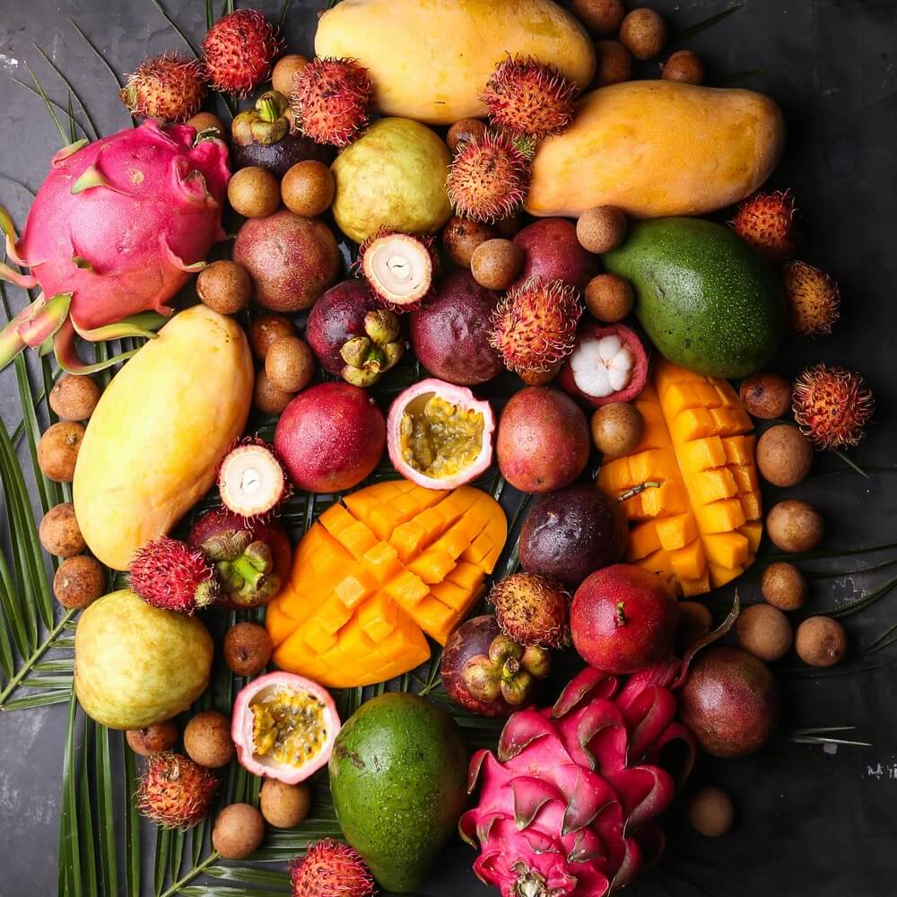

# Проект "Экзотические фрукты"

Выполнен в качестве практического задания 10.11 на курсе Профессия "Веб-разработчик" от SkillFactory (в качестве основы использован этот [шаблон](https://github.com/SkillfactoryCoding/module11)).

***

## Используемые технологии

* HTML
* CSS
* JavaScript
* JSON

***

### Планы по доработке

* [x] Добавить кнопку общего сброса.

* [ ] Добавить сортировку по весу фруктов.

* [ ] Добавить меню выбора цвета для нового фрукта.

* [ ] Улучшить взаимодействие с полями ввода данныx.

* [ ] Оптимизировать код и отредактировать комментарии.

***

#### Как открыть

Зайти в папку сайта в файловом менеджере, кликнуть 2 раза по файлу index.html.

Ссылка на проект: <https://difese.github.io/ExoFru/>

***

#### *Дата последнего редактирования: 16.01.2023 г.*
